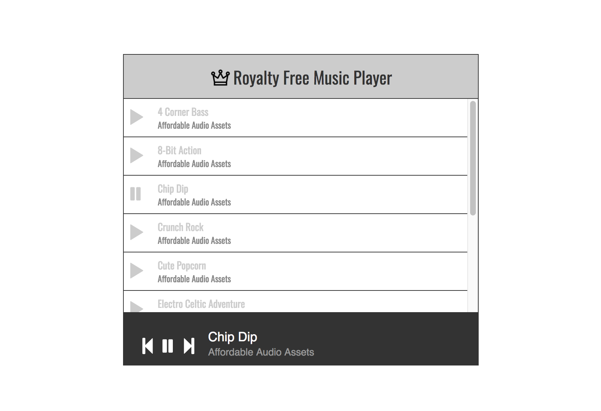

# Royalty Free Music Player - JavaScript/jQuery

HTML, CSS, JavaScript, jQuery

Here is my music player based on a images provided by VCS. The music player holds a playlist of some royalty free songs. You can play any of them and jump between songs. Here are some requirements that this projects meet, originally requested by Viking Code School:
- A list of songs listed with their artists
- Each song should either be clickable or have a play button
- Each song should display differently when it’s being played
- A status bar with a play/pause button and the information for the current track
- The status bar should also have next and previous track buttons

## Getting Started

You can clone the repository to your laptop and run index.html from the project folder in your browser.

## Authors

* **Dariusz Biskupski** - *Initial work* - https://dariuszbiskupski.com

## Acknowledgments

This assignment I created for [Viking Code School](https://www.vikingcodeschool.com/)
